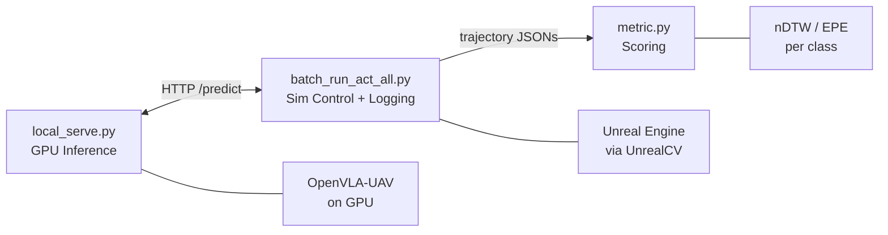
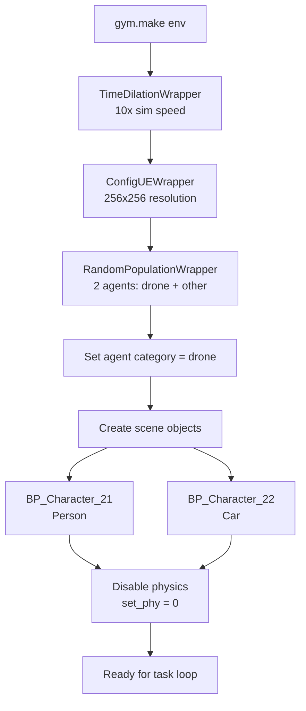
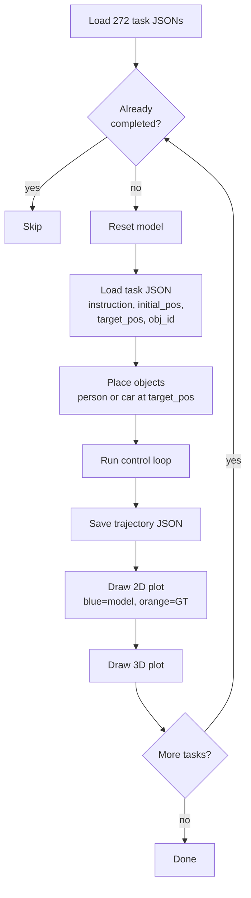
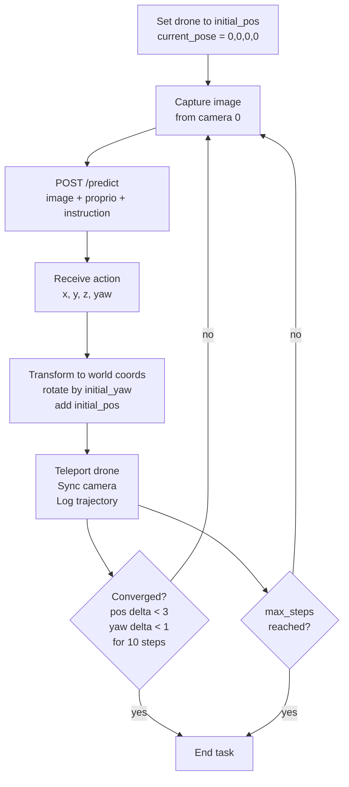
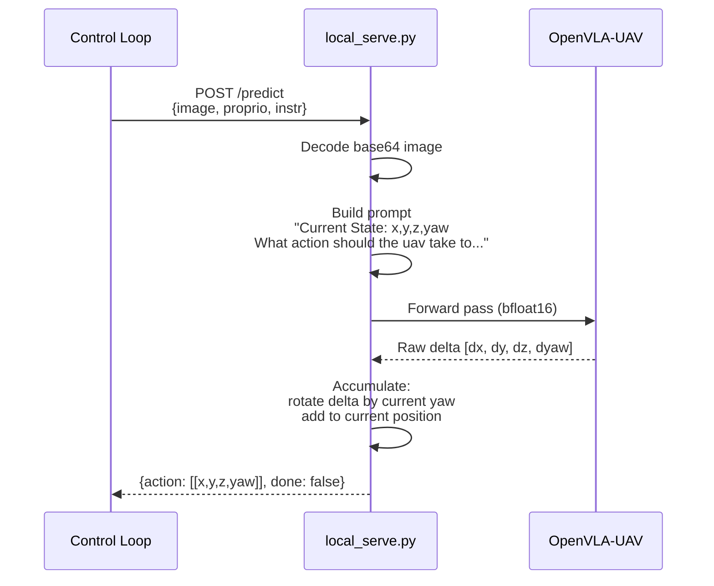
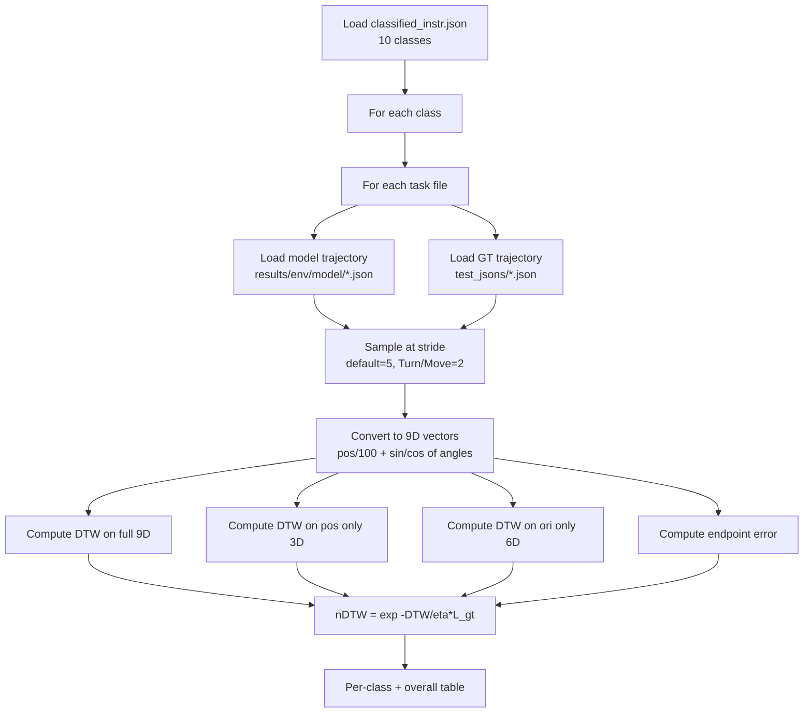
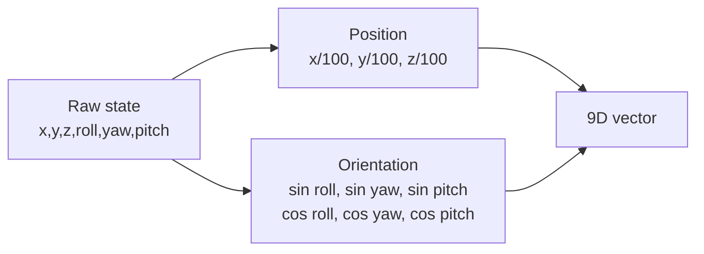
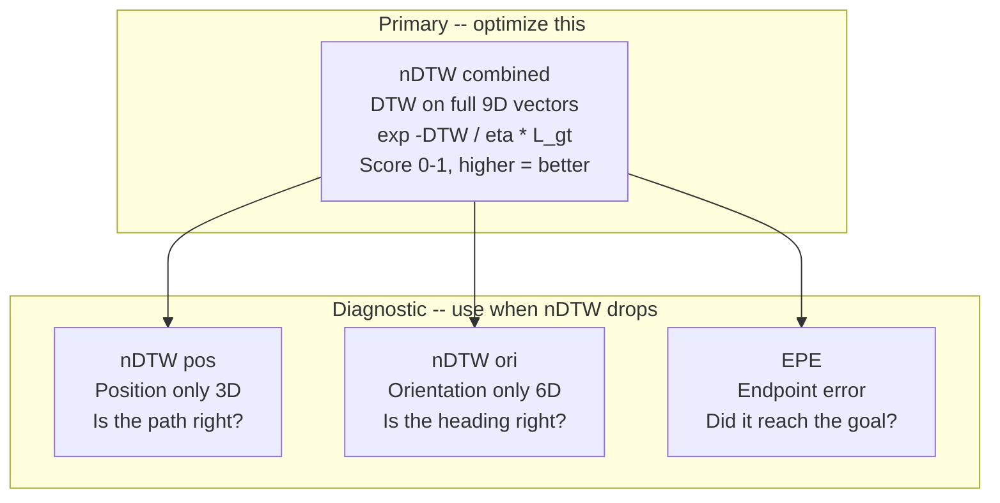
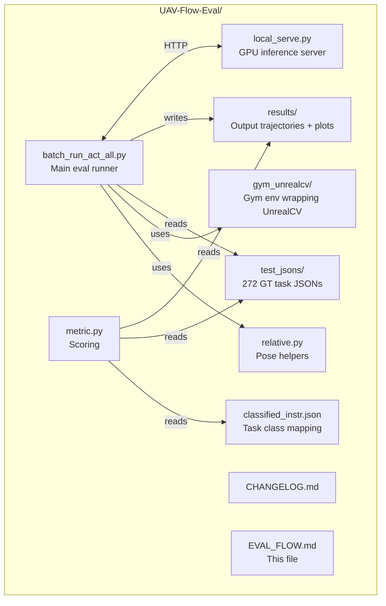

# UAV-Flow Evaluation Flow

End-to-end guide to how the closed-loop simulation evaluation works.

---

## Overview



Three stages: **environment setup**, **task execution** (stop-and-infer control loop), and **metric computation**.

---

## Stage 1: Environment Setup

**File:** `batch_run_act_all.py`



1. **Create gym env** -- loads `DowntownWest.json` config and connects to Unreal Engine via UnrealCV over TCP.
2. **Wrap the env** in three layers for time dilation, render resolution, and agent population.
3. **Set agent category to drone** -- the env supports players/animals/cars but eval only controls the drone.
4. **Create two scene objects** -- a person and a car. These are reference objects that tasks mention ("fly toward the person"). Created once, repositioned per task.
5. **Disable physics** -- the drone is teleported to positions, not physically simulated.

---

## Stage 2: Task Execution

**Files:** `batch_run_act_all.py`, `local_serve.py`

### Task Loop



For each task JSON:
- `instruction` -- natural language task (e.g. "Fly toward the person")
- `initial_pos` -- 6D start pose `[x, y, z, roll, yaw, pitch]`
- `target_pos` -- 6D target pose (for object placement and plotting)
- `obj_id`, `use_obj` -- which object to place and what appearance
- `reference_path_preprocessed` -- ground truth trajectory for plot overlay

### Control Loop (Stop-and-Infer)

The core evaluation loop. The drone stops, gets a prediction, moves, repeats.



**Key details:**

- **Local frame** -- the model works relative to the start pose. `current_pose = [0,0,0,0]` at the beginning. The server accumulates deltas internally (rotates by current yaw, adds to current position) and returns cumulative local-frame positions.

- **World transform** -- the control loop converts local-frame predictions to world coordinates: rotate `[x,y]` by `initial_yaw`, then add `[initial_x, initial_y, initial_z]`.

- **The -180 offset** -- `set_rotation(drone, yaw - 180)` because UE's forward direction convention differs from the task JSONs.

- **Camera sync** -- `set_cam()` is called after every teleport because the camera isn't auto-attached to the drone in UnrealCV. It reads the drone's position/rotation and manually sets camera 0 to match.

### Inference Server

**File:** `local_serve.py`



The server also supports `chunk_size > 1` for multi-step prediction (used in real-world deployment, not sim eval).

---

## Stage 3: Metric Computation

**File:** `metric.py`

Run separately after all tasks complete: `python metric.py`

### Pipeline



### 10 Task Classes

| Class          | Count | Description                     |
|----------------|-------|---------------------------------|
| Turn           | 15    | Yaw rotation in place           |
| Move           | 15    | Forward/backward movement       |
| Shift          | 49    | Lateral movement                |
| Rotate         | 15    | Rotation (similar to Turn)      |
| Surround       | 12    | Circular motion around target   |
| Ascend/Descend | 19    | Vertical movement               |
| Approach       | 42    | Move toward target              |
| Retreat        | 12    | Move away from target           |
| Pass           | 41    | Fly past target                 |
| Land           | 54    | Descend to ground               |

### 9D Vector Encoding



- Position divided by 100 to scale with rotation components
- Both sin and cos for angles (captures rotation direction -- cos alone can't distinguish left from right)
- Turn/Rotate classes: position zeroed out (orientation-only evaluation)

### Metrics



### Output

Per-class table + overall summary printed to `metric.txt`:

```
+----------------+-------+--------+-----------+-----------+--------+
| Class          | #Eval |   nDTW | nDTW(pos) | nDTW(ori) |    EPE |
+----------------+-------+--------+-----------+-----------+--------+
| Turn           |    15 | 0.2392 |         - |    0.2392 | 0.0000 |
| ...            |       |        |           |           |        |
+----------------+-------+--------+-----------+-----------+--------+
```

**For the train/eval feedback loop:** optimize combined nDTW. Use the split and EPE for diagnosing what went wrong.

---

## File Map



---

## Running the Eval

```bash
# 1. Start Unreal Engine (Windows side if on WSL)

# 2. Start inference server
python local_serve.py --port 5007

# 3. Run evaluation
python batch_run_act_all.py

# 4. Compute metrics
python metric.py
```

Results go to `results/<env>/openvla/` (trajectory JSONs + plots) and `metric.txt` (scores).
